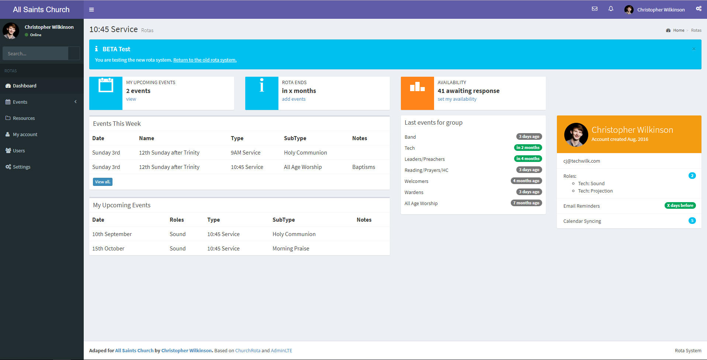

# Rota  

Rota is a web-based system for rota management, which can send email reminders and link with all good digital calendars.

Rota was designed for Churches, but can be used by any group or Organisation who requires similar functionality. Adhering to best practices, if you find you need Rota to do something new, it should pretty easy to extend it too!

## What makes Rota so great?

- Responsive interface for phones/tablets/laptops/computers
- Secure login (or use with an existing service, inc. [Facebook](https://developers.facebook.com/docs/facebook-login), [OneBody](https://church.io/onebody), etc.)
- Email reminders before events
- Swap roles with others easily
- Manage rota for multiple groups in one place
- Automatically have events added to your digital calendar (through an iCal feed)

## Count me in! How do I use this thing...?

Rota can be installed on almost any PHP web host, possibly even on the one your website is already on...

### What you'll need:

- Web host running PHP 5.6 or above (recommended PHP 7.0)
- MySQL database (or an alternate DB which works with [PDO](http://php.net/manual/en/pdo.drivers.php), we've only tested MySQL though)
- [Mailgun](https://www.mailgun.com/) account for email sending (10,000 email/month free) - or sendmail if you're feeling brave...

### Installation

There are a couple of methods to use

COMING SOON...

***

## Contributers are awesome!

Want new features? Found a bug? Why not help us out by contributing!

We're always keen to have a hand! Here's what you need to know before you show us how awesome you're skills are...

### Standards are handy

We conform to the PSR code standards wherever possible. Specifically you should familiarise yourself with:

  - [PSR-2: Coding Style Guide](http://www.php-fig.org/psr/psr-2/)
  - [PSR-4: Autoloader](http://www.php-fig.org/psr/psr-4/)
  - [PSR-7: HTTP message interfaces](http://www.php-fig.org/psr/psr-7/)

### Frameworks are cool

Why spend time writing code which someone has already written?!

We use, among others:

- [Slim Framework](https://www.slimframework.com)
- [TWIG templating engine](https://twig.symfony.com/)
- [Propel ORM](http://propelorm.org)
- [Monolog logger](https://github.com/Seldaek/monolog)
- [Guzzle HTTP client](https://github.com/guzzle/guzzle)
- [AdminLTE template](https://adminlte.io/) (based on [Bootstrap](http://getbootstrap.com/))

### Unit tests are epic

Why risk breaking old code when you can write software to test it?!

All new code should have testcases written for [PHPUnit](https://phpunit.de/). We are working to add tests to all the existing functionality when we have the time.

## Oooh, badges...!

Rota started life as a fork of [ChurchRota](https://sourceforge.net/projects/churchrota/), although we've almost entirely re-written it to adhere to modern coding standards and best practices.